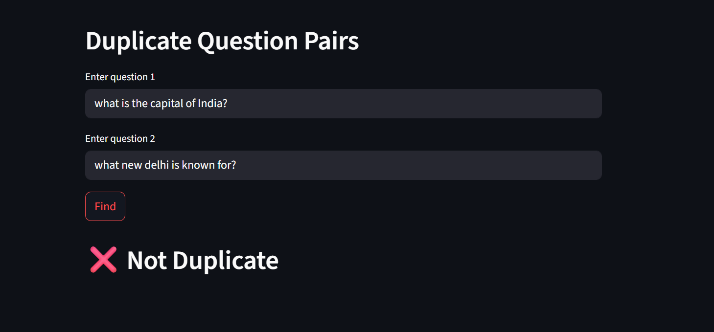
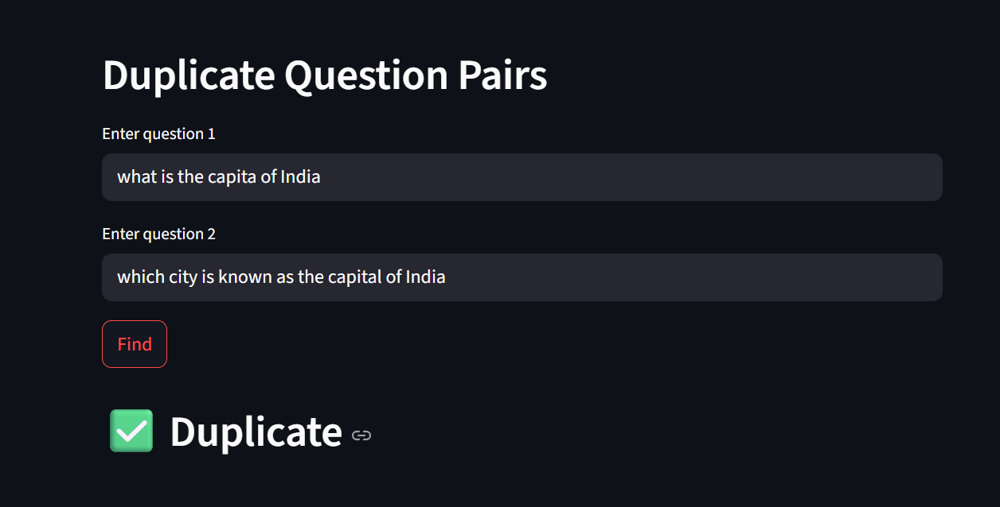

#  Duplicate Question Detector | Quora-Inspired NLP Project

A machine learning and NLP-based app that detects whether two questions are semantically **duplicate or not**, inspired by the famous [Quora Question Pairs Kaggle Competition](https://www.kaggle.com/competitions/quora-question-pairs/overview).

**Live Demo:** [Click here to try it out](https://quora-qp-project00.streamlit.app/)

---

## Problem Statement

Quora users often post similar questions phrased differently. This results in multiple answers scattered across duplicates, reducing efficiency and clarity. 

To solve this, a duplicate detection model is used to **identify whether two questions mean the same thing**, even if they’re phrased differently.

---

## Key Features

✅ Fully deployed NLP project using **Streamlit**  
✅ Includes full NLP pipeline: preprocessing → feature engineering → model → UI  
✅ Uses **RandomizedSearchCV** for hyperparameter tuning of XGBoost  
✅ Real-time duplicate prediction with intuitive UI   

---

## 🧠 NLP & Feature Engineering Pipeline

### 🔧 Text Preprocessing
- Lowercasing
- Removal of HTML tags
- Removal of special characters and punctuation
- Tokenization

### 🧪 Text Representation Techniques
- **Bag of Words (BoW)**
- **Word2Vec Embeddings**

### 🧩 Advanced Feature Engineering
- **Length-based features** (number of characters, number of words, average word length, etc.)
- **Fuzzy features**:
  - Fuzzy Wuzzy Token Sort Ratio
---

## ⚙️ Model & Tools Used

| Component       | Technology |
|----------------|------------|
| ML Model        | XGBoost    |
| UI              | Streamlit  |
| NLP Libraries   | NLTK, FuzzyWuzzy, Distance|
| Vectorization   | Word2Vec, CountVectorizer |

